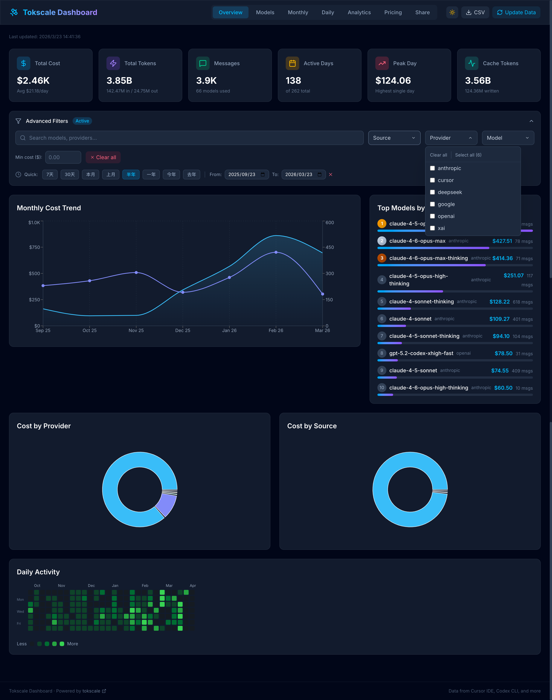
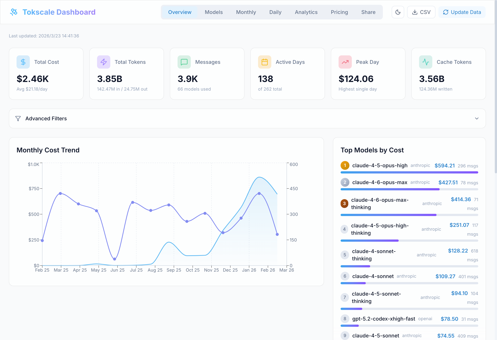
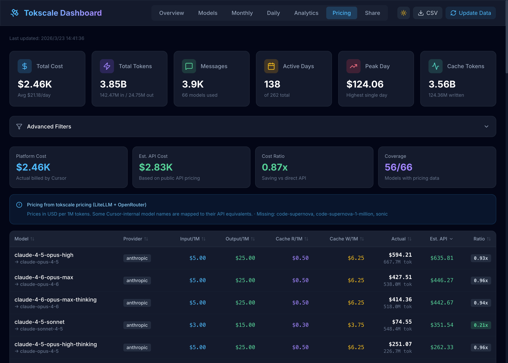
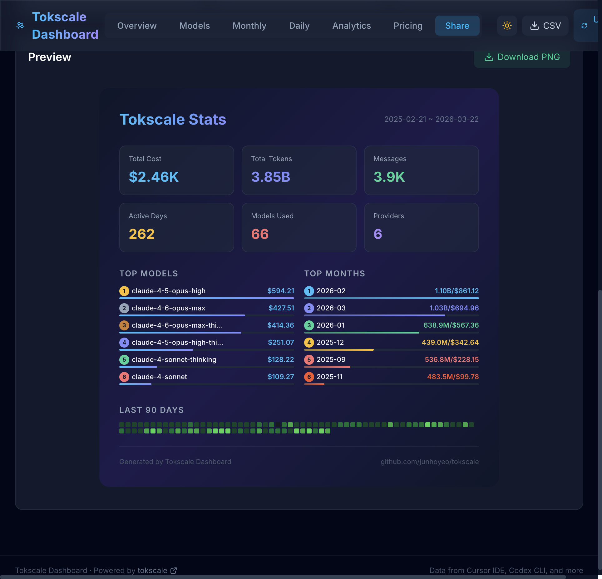
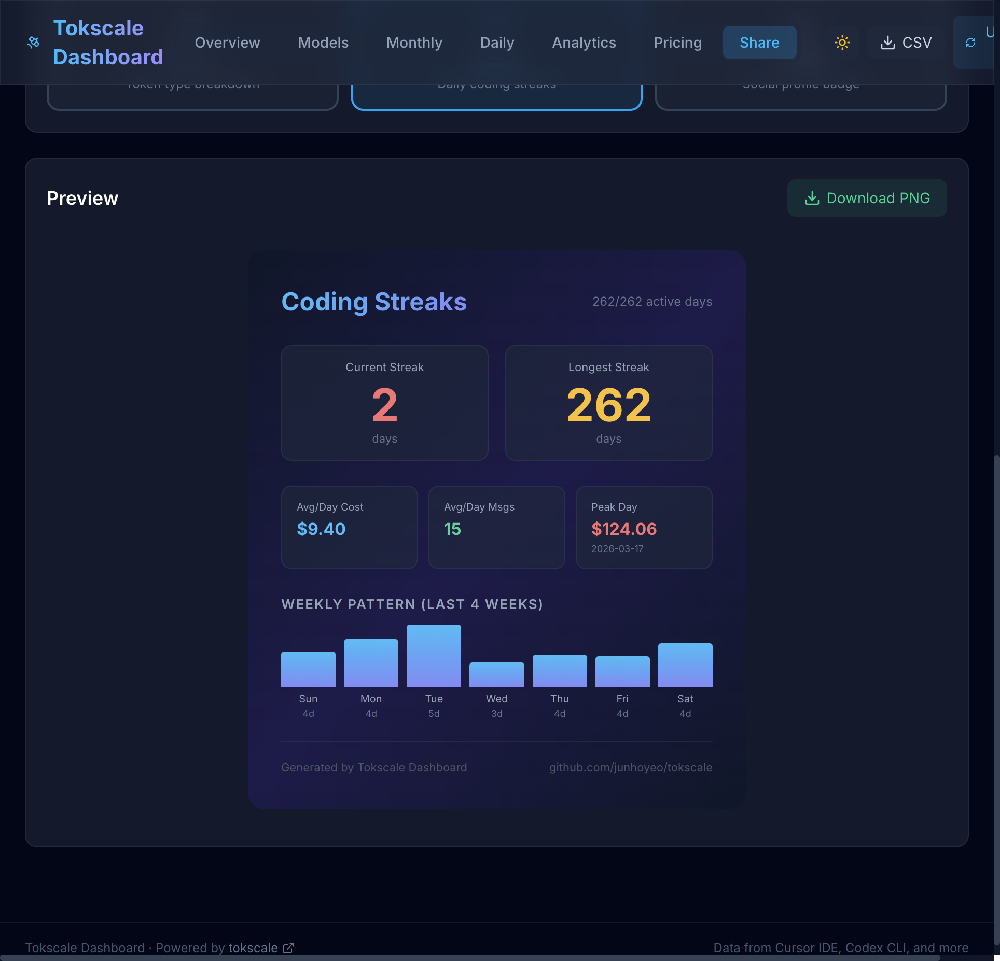
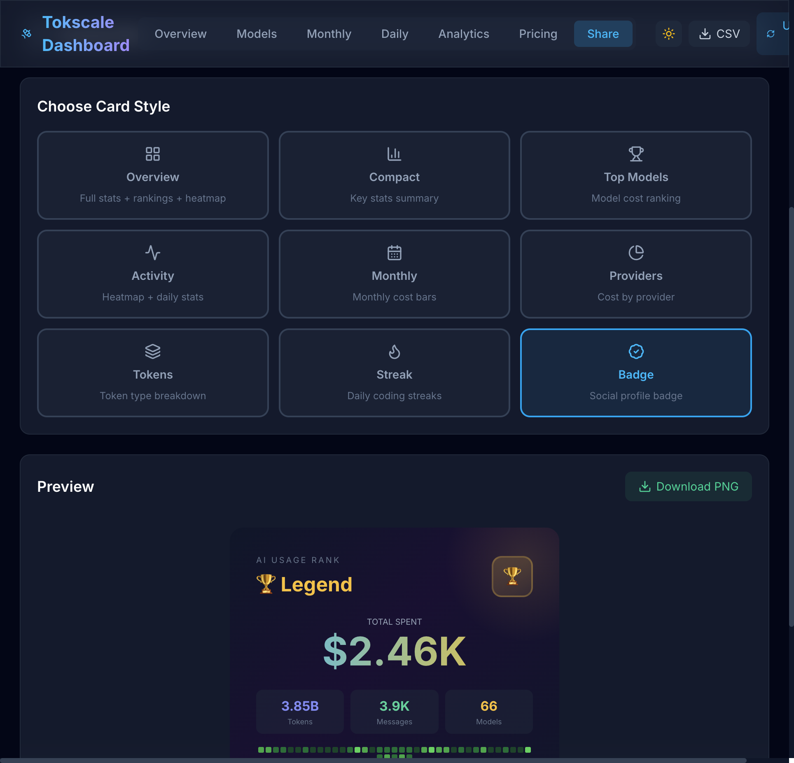

# Tokscale Dashboard

**[English](README.md)**

强大且精美的 AI 编程助手 Token 用量分析看板。基于 [tokscale](https://github.com/junhoyeo/tokscale) 数据，Go 后端 + React 前端构建。



## 为什么选择 Tokscale Dashboard？

如果你在使用 **Cursor**、**Codex CLI**、**Claude Code** 或 **Gemini CLI** 等 AI 编程助手，你很可能在 Token 上花费了不少钱，却没有清晰的成本可视化。Tokscale Dashboard 为你提供：

- **完整的费用可视化** — 清楚知道每一分钱花在了哪里
- **模型级分析** — 跨 60+ 模型对比费用、Token 用量和消息数
- **平台 vs API 定价对比** — 看看你的平台订阅是否真的比直接调 API 更省钱
- **精美分享卡片** — 生成 9 种风格的 PNG 卡片，分享你的 AI 使用统计

## 截图预览

| 深色模式 | 浅色模式 | 定价对比 |
|:-:|:-:|:-:|
|  |  |  |

### 分享卡片

生成精美的 PNG 卡片，分享你的 AI 使用数据：

| 总览卡片 | 连续使用卡片 | 徽章卡片 |
|:-:|:-:|:-:|
|  |  |  |

## 核心功能

### 数据分析与可视化
- **总览仪表盘** — 总花费、Token 数量、消息数、活跃天数、峰值日、缓存统计一目了然
- **月度费用趋势** — 交互式折线图追踪费用和消息量的月度变化
- **每日活动热力图** — GitHub 风格的 AI 使用贡献图
- **Provider/Source 分布** — 饼图展示各 Provider（Anthropic、OpenAI、Google 等）的费用占比
- **Top 模型排行** — 按费用排名的最常用（最贵）模型
- **Token 类型分析** — 按月展示 Input/Output/Cache Read/Cache Write/Reasoning 分布
- **每日用量图表** — 精细的每日费用和 Token 分析

### 定价智能
- **模型价格表** — 来自 LiteLLM 和 OpenRouter 的实时定价数据，覆盖 56+ 模型
- **成本对比** — 每个模型的平台费用 vs 估算的直接 API 费用
- **费率分析** — 一眼看出哪些模型在平台上更便宜，哪些直接调 API 更划算
- **自动模型映射** — 自动将平台内部模型名映射到公开 API 模型名

### 高级筛选
- **多维度筛选** — 按 Source、Provider、Model、日期范围、最低费用筛选
- **快速日期预设** — 一键选择 7天、30天、本月、上月、半年、一年
- **全文搜索** — 在模型和 Provider 中搜索
- **实时更新** — 筛选条件变化时所有图表和表格即时更新

### 分享卡片
- **9 种卡片模板** — 总览、简洁、Top模型、活动、月度、Provider、Token分布、连续天数、社交徽章
- **PNG 导出** — 2 倍分辨率高清 PNG 下载
- **暗色主题卡片** — 所有卡片采用高级暗色设计，适合分享
- **等级系统** — 徽章卡片根据总花费显示从 Starter 到 Legend 的等级

### 主题与体验
- **深色/浅色模式** — 完整的主题支持，偏好自动保存
- **毛玻璃效果 UI** — 现代磨砂玻璃设计，流畅动画
- **响应式布局** — 适配桌面和平板
- **CSV 导出** — 一键导出全部数据
- **一键数据刷新** — 重新从 tokscale CLI 采集最新数据

## 技术栈

| 层 | 技术 |
|---|---|
| 后端 | Go (标准库, 零依赖) |
| 前端 | React 19 + TypeScript + Vite |
| 样式 | Tailwind CSS v4 |
| 图表 | Recharts |
| 图标 | Lucide React |
| 图片导出 | html-to-image |
| 数据源 | [tokscale](https://github.com/junhoyeo/tokscale) CLI |

## 快速开始

### 环境要求
- Go 1.21+
- Node.js 18+ 和 npm
- [Bun](https://bun.sh)（用于 tokscale CLI 数据采集）

### 安装启动

```bash
# 克隆仓库
git clone https://github.com/pdajoy/tokendashboard.git
cd tokendashboard

# 构建 (Go 后端 + React 前端)
bash scripts/build.sh

# 采集数据 (需要 tokscale CLI)
bash scripts/update-data.sh

# 启动看板
bash scripts/start.sh
# 浏览器打开 http://localhost:8787
```

### 开发模式

```bash
# 同时启动 Go 后端 + React dev server（热更新）
bash scripts/dev.sh
# 浏览器打开 http://localhost:5173
```

## 脚本说明

| 脚本 | 说明 |
|---|---|
| `scripts/build.sh` | 构建 Go 后端 + React 前端 |
| `scripts/update-data.sh` | 通过 tokscale CLI 采集最新数据 |
| `scripts/start.sh` | 启动生产模式（自动构建） |
| `scripts/dev.sh` | 启动开发模式（热更新） |

## API 端点

| 端点 | 方法 | 说明 |
|---|---|---|
| `/api/models` | GET | 模型使用明细 |
| `/api/monthly` | GET | 月度汇总 |
| `/api/graph` | GET | 每日贡献数据 |
| `/api/pricing` | GET | 模型定价数据 |
| `/api/meta` | GET | 数据更新时间 |
| `/api/export/csv` | GET | 导出 CSV |
| `/api/refresh` | POST | 触发数据刷新 |
| `/api/health` | GET | 健康检查 |

## 项目结构

```
tokscale-dashboard/
├── backend/              # Go 后端服务
│   ├── go.mod
│   └── main.go           # HTTP 服务器、API 路由、CORS
├── frontend/             # React 前端
│   ├── src/
│   │   ├── App.tsx        # 主应用（标签页路由）
│   │   ├── api.ts         # API 客户端
│   │   ├── components/    # 所有 UI 组件
│   │   ├── hooks/         # 自定义 React Hooks
│   │   └── types/         # TypeScript 接口定义
│   └── dist/              # 生产构建产物
├── data/                  # tokscale JSON 数据文件
├── docs/                  # 文档和截图
├── scripts/               # 构建和管理脚本
└── bin/                   # Go 编译产物
```

## 许可证

MIT

## 致谢

- 数据由 [tokscale](https://github.com/junhoyeo/tokscale)（Junho Yeo）驱动
- 定价数据来自 [LiteLLM](https://github.com/BerriAI/litellm) 和 [OpenRouter](https://openrouter.ai)
